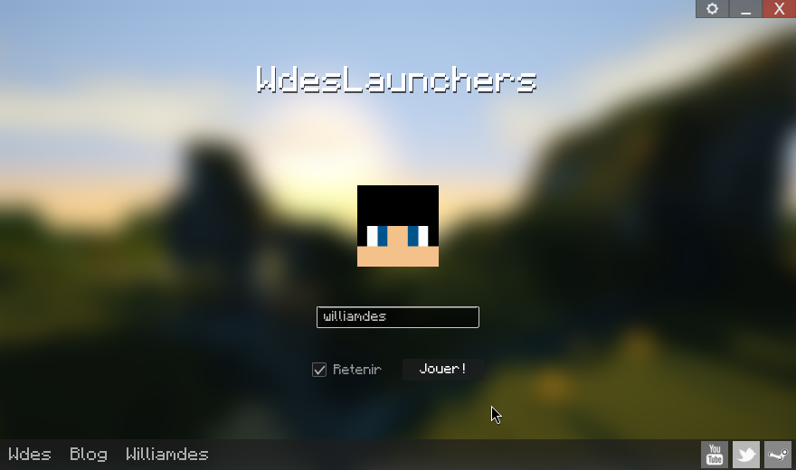

# WdesLaunchers

A custom Minecraft launcher written in Swing, targeting operators who want to
ship their own branded launcher on top of Mojang's vanilla version catalogue
— with optional operator-served mirrors for modded / custom versions.



## What it does

- **Vanilla versions via Mojang.** Fetches the
  [`version_manifest_v2.json`](https://piston-meta.mojang.com/mc/game/version_manifest_v2.json)
  from `piston-meta.mojang.com`, per-version JSONs from the hash-addressed
  `piston-meta` URLs, client jars from `piston-data.mojang.com`, asset indexes
  from `piston-meta`, asset objects from `resources.download.minecraft.net` and
  libraries from `libraries.minecraft.net`. Supports both the legacy
  `minecraftArguments` flat-string format (≤ 1.12) and the
  `arguments.{game,jvm}` object format (1.13+).

- **Operator mirror for modded or custom versions.** Any versions published in
  `<URL_DOWNLOAD_VERSIONS_BASE>/versions/versions.json` are merged into
  Mojang's manifest and **take precedence on id collision** — so a custom
  `1.7.10` from your mirror shadows Mojang's vanilla one, and
  `1.7.10-forge10.13.4` shows up in the dropdown next to vanilla without any
  extra configuration. See [Operator mirror layout](#operator-mirror-layout).

- **Offline survival.** Every JSON fetched at runtime (manifest, per-version
  JSON, asset index) is written to `<workingDir>/cache/` or
  `<workingDir>/versions|assets/...` before being handed to the parser. Once a
  version has been seen online at least once, the launcher can start and play
  that version fully offline.

- **Yggdrasil-compatible auth.** The login form talks to your own auth server
  configured via `URL_AUTHENTIFICATION_SYSTEM` in the operator config — Mojang
  credentials are never sent. A reference server implementation lives at
  [`wdesportes/minecraft.auth.server`](https://github.com/wdesportes/minecraft.auth.server);
  anything else speaking the same Yggdrasil API contract (the `/authserver/*`
  endpoints) will work too.

- **Per-server theming.** The bottom-bar text links and social icons are
  defined in the operator config (`links[]` and `socials{}`) and only render
  the entries you define; the window background rotates through images fetched
  from a `URL_FONDS_DOWNLOAD` mirror, with a time-of-day folder convention
  (`jour` / `soiree` / `nuit`) and falls back to the bundled background if a
  folder is empty.

- **Diagnostics built in.** Every launcher boot prints:

  ```
  [ INFO ] [build] commit=<sha> branch=<name> built=<timestamp>
  ```

  (injected by [`git-commit-id-plugin`](https://maven.apache.org/plugins/index.html)
  into the jar) so a bug report always pins down the exact source tree.

- **Post-mortem hints for known JVM / Minecraft crashes.** When the game
  process exits, the launcher dumps exit code, full argv and the last lines of
  its stdout to the log. For the most common failures it also pops a French
  modal dialog pointing at the fix (e.g. the pre-1.8 launchwrapper
  `URLClassLoader` cast that blows up on Java 9+, or the GNOME ATK wrapper
  missing on Debian/Ubuntu OpenJDK 8).

## Quick start

Requires Java 8+ to build (Java 8 still necessary to **run** pre-1.8 Minecraft
versions because of the `launchwrapper` URLClassLoader cast).

```bash
git clone https://github.com/wdesportes/minecraft_launcher_wdes.git
cd minecraft_launcher_wdes
mvn clean package
java -jar target/wdes-launcher-2.0.0-jar-with-dependencies.jar
```

The assembly plugin bakes every dependency into the single jar, so no
classpath juggling at runtime.

Run the tests with:

```bash
mvn test
```

and the minimal house-style checker with:

```bash
mvn checkstyle:check
```

## Configuration

On startup the launcher fetches its configuration from

```
<URL_CONFIGS>/<UUID>.conf
```

where `<URL_CONFIGS>` is a hardcoded constant in
[`LauncherConstants.java`](src/main/java/fr/wdes/LauncherConstants.java) and
`<UUID>` is passed by the bootstrap (currently
`33a86c10-1e71-4e51-83b5-bdf218f29b97`). The shape is:

```jsonc
{
  "nom": "Wdes",
  "version": "1.7.10",              // "auto-mc" = let the profile decide
  "width": 880,
  "height": 520,
  "URL_FONDS_DOWNLOAD": "http://example.com/fonds/",
  "PLACEHOLDER_LOGIN": "Utilisateur",
  "PLACEHOLDER_PASSD": "Mot de passe",
  "URL_AUTHENTIFICATION_SYSTEM": "https://example.com/minecraft-auth/",

  // Bottom-left text links. Omit entirely to hide all of them.
  "links": [
    { "url": "https://example.com",       "name": "Site",  "tooltip": "Home" },
    { "url": "https://blog.example.com",  "name": "Blog",  "tooltip": "Blog" }
  ],

  // Bottom-right social icons keyed by network id. Icons show in
  // right-to-left order; skipped keys leave no gap.
  "socials": {
    "twitter": { "url": "https://x.com/you",               "tooltip": "Twitter" },
    "youtube": { "url": "https://youtube.com/@you",        "tooltip": "YouTube" },
    "facebook":{ "url": "https://facebook.com/you",        "tooltip": "Facebook" },
    "steam":   { "url": "https://steamcommunity.com/id/you","tooltip": "Steam" }
  }
}
```

## Operator mirror layout

`URL_DOWNLOAD_VERSIONS_BASE` is the root of your optional mirror. The launcher
hits the following paths on demand:

| Path | Purpose |
|---|---|
| `versions/versions.json` | List of modded / custom versions, merged into Mojang manifest. Omit if you only want vanilla. |
| `versions/<id>/<id>.json` | Per-version JSON for operator-owned ids (shadowed vanilla ids or mirror-only ids). |
| `versions/<id>/<id>.jar` | Jar fallback when the per-version JSON has no `downloads.client.url`. |
| `indexes/<id>.json` | Asset-index fallback when the per-version JSON has no `assetIndex.url`. |

Nothing here is required for vanilla Mojang versions — those are fetched from
`piston-meta` / `piston-data`. The mirror only matters for entries the operator
publishes.

A typical `versions/versions.json`:

```jsonc
{
  "latest": {
    "release":  "1.7.10",
    "snapshot": "1.7.10"
  },
  "versions": [
    {
      "id": "1.7.10",
      "type": "release",
      "time":        "2014-05-14T19:29:23+02:00",
      "releaseTime": "2014-05-14T19:29:23+02:00"
    }
  ]
}
```

`latest` is merged per-key — anything you define here wins over Mojang; keys
you omit fall through to Mojang's values. This is how you pin the launcher's
default "latest release" to your supported server version.

## Development

### Modules
- `fr.wdes.launcher.Wdes` — main class, splash window.
- `fr.wdes.Launcher` — singleton, owns the JFrame, config, version manager,
  profile manager, SQLite cache (`~/.wdeslaunchers/wdeslaunchers.db`).
- `fr.wdes.updater.*` — version manifest parsing, download scheduling, local
  cache invalidation.
- `fr.wdes.GameLauncher` — builds the `java -cp ... net.minecraft.client...`
  process, evaluates `arguments.game` rules, monitors stdout, surfaces known
  crashes.
- `fr.wdes.ui.*` — Swing UI. `fr.wdes.ui.lite.*` holds the glassy painted
  controls (LiteTextField, LiteComboBox, LiteCheckBox, LiteButton,
  LogoLabel, …).

### Style

`.editorconfig` and `checkstyle.xml` define the minimum house rules:

- Final newline, no trailing whitespace, no CRLF, no star / unused imports.
- `new Integer(int)` and friends banned (JDK 16+ removal).
- Lines capped at 300 chars.
- `System.out.println` / `System.err.println` discouraged — use `fr.wdes.logger`.

Severity is `warning`, so legacy files keep compiling. Run
`mvn checkstyle:check` for a report.

### Tests

JUnit 4, lightweight smoke tests around the non-UI bits:

- `RemoteVersionListTest` — manifest merge, operator override, path helpers,
  Gson round-trips of real Mojang & operator JSON.
- `JObjectContainerTest` — config shape including the live operator config.
- `ProfileVersionResolutionTest` — dropdown-pick precedence.
- `LibraryArtifactPathTest` — Maven coordinates including the 1.13+ four-part
  classifier layout.
- `BuildInfoTest` — `git.properties` resilience.

### Build marker

Every `mvn package` embeds a `git.properties` generated by
`pl.project13.maven:git-commit-id-plugin`. `fr.wdes.BuildInfo` reads it at
startup; the first lines of the launcher log always tell you exactly which
commit is running. If you see `commit=unknown`, the jar was built outside a
git working tree.

## Known caveats

- **Pre-1.8 Minecraft on Java 9+.** `launchwrapper ≤ 1.11` casts
  `ClassLoader.getSystemClassLoader()` to `URLClassLoader`. That only works on
  Java 8. Set the profile's *Executable Java* field to a Java 8 install. The
  launcher detects this crash and pops a French dialog walking the user
  through the fix.
- **Debian / Ubuntu OpenJDK 8.** Ships
  `/etc/java-8-openjdk/accessibility.properties` referencing
  `org.GNOME.Accessibility.AtkWrapper` without installing it. The launcher
  detects the resulting `AWTError` and offers three remedies (JVM arg, apt
  package, `sed` the config file).
- **Modern multiplayer service calls.** The launcher currently passes
  `-Dminecraft.api.env=local` to silence the in-game Realms availability
  checker. That also short-circuits the services API, which is fine for
  offline / LAN play against offline-mode servers. Enabling Yggdrasil-backed
  online multiplayer would mean shipping `authlib-injector` as a `-javaagent`
  — straightforward if the operator has a full Yggdrasil implementation.

## License

Spoutcraft Launcher heritage — most files carry the Spout License Version 1
header. See the individual file headers for terms.
